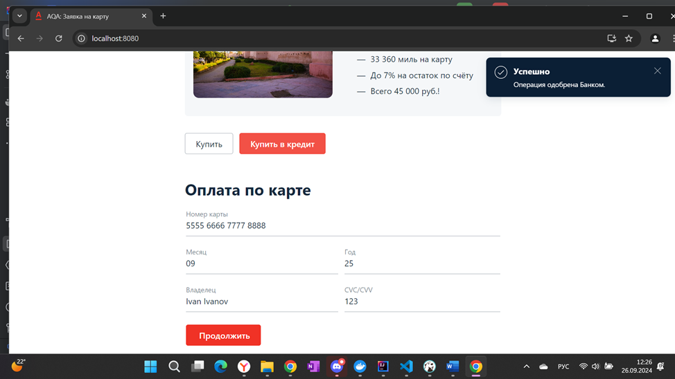

# 1. Сервис принимает отклонённую карту (5555 6666 7777 8888) как успешную.

## Шаги для воспроизведения:

### Открыть веб-сервис покупки тура.
1. Перейти к форме оплаты.
2. Ввести данные тестовой карты с номером 5555 6666 7777 8888 (DECLINED карта).
3. Заполнить остальные поля формы (месяц, год, владелец карты, CVC) валидными (год не должен быть прошлым, CVC состоит из трёх цифр и т. д.) данными.
4. Нажать на кнопку "Продолжить".

### Ожидаемый результат:
Платёж должен быть отклонён. Сервис должен вывести сообщение об ошибке или отказе в оплате.

### Фактический результат:
Платёж принимается, выводится сообщение "Успешно. Операция одобрена Банком", несмотря на то, что карта с номером 5555 6666 7777 8888 помечена как отклоняемая (DECLINED).

## Окружение:
Windows 11.0 Домашняя 21H2 сборка 22000.2538
Браузер: Chrome 125.0.6422.142 (Официальная сборка), (64 бит)
IntelliJ IDEA 2024.1 (Community Edition)

### *Дополнительная информация:*
Карта с номером 5555 6666 7777 8888 (DECLINED) должна отклоняться, однако система обрабатывает её как принимаемую (APPROVED).

# 2. Сообщение об ошибке при вводе имени и фамилии на кириллице в поле "Владелец".

## Шаги для воспроизведения:

### Открыть веб-сервис покупки тура.
1. Перейти к форме оплаты.
2. Ввести валидные данные для номера карты, месяца, года и CVC.
3. В поле "Владелец" ввести имя и фамилию на кириллице (например, "Иван Иванов").
4. Нажать на кнопку "Продолжить".

### Ожидаемый результат:

Под полем "Владелец" должно появиться сообщение: "Неверный формат". Поле "Владелец" должно принимать только латиницу.

### Фактический результат:
Появляется сообщение "Ошибка. Банк отказал в проведении операции", что не соответствует ошибке формата заполнения поля формы.

## Окружение:
Windows 11.0 Домашняя 21H2 сборка 22000.2538
Браузер: Chrome 125.0.6422.142 (Официальная сборка), (64 бит)
IntelliJ IDEA 2024.1 (Community Edition)

### *Дополнительная информация:*

Сообщение сервиса не указывает на реальную проблему с форматом поля "Владелец".

